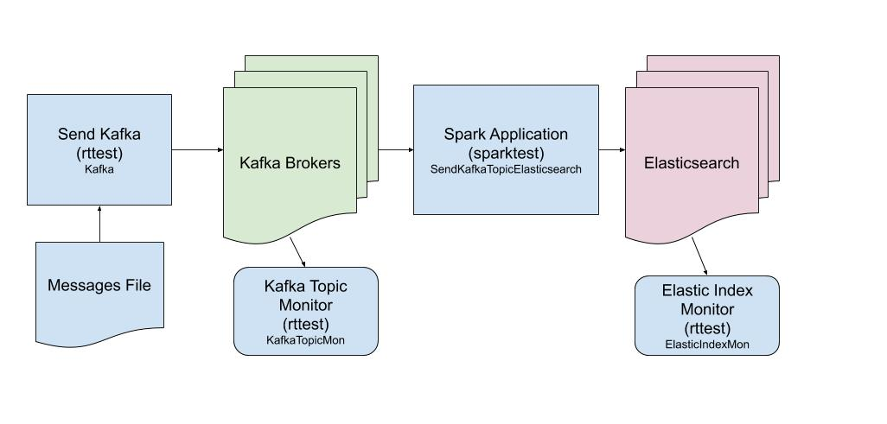

## elastic-ingest

This repo documents ingest rates achieved using Spark to load message from Kakfa to Elasticsearch.

Test Overview
- Java application reads lines from a file; then sends those messages to a Kakfa topic
- Spark application consumes the Kafka Topic; reads the messages and writes them to Elasticsearch
- Monitor tools are used to measure the rate at which messages are written to Kafka and Elasticsearch

## Summary of Test Results

VM's size
- Azure: D16s_v3
- AWS: M5.4xlarge

Tests
- **Az Vms**: 24 VM's (10 Elasticsearch, 10 Spark, 3 Kafka, 1 Test)
- **AKS 1.12**: 14 VM's, k8s 1.12; Advanced Networking; Premium Drives
- **AKS Px**: 14 VM's, k8s 1.12, Portworx (replication factor 3; encrypted)
- **EKS 1.12**: 14 VM's, k8s 1.12, Storage Class: gp2
- **AKS 1.13**: 14 VM's, k8s 1.13; Advanced Networking; Premium Drives
- **AKS 24**: 24 VM's, k8s 1.13; Advanced Networking; Premium Drives
- **EKS 1.13**: 24 VM's, k8s 1.13; Storage Class: gp2

|# es Nodes|Az Vms  |AKS 1.12|AKS Px  |EKS 1.12|AKS 1.13|AKS 24   |EKS 1.13|
|----------|--------|--------|--------|--------|--------|---------|--------|
|1         |83      |        |        |        |        |         |        |
|3         |223     |161     |        |180     |        |         |        |
|5         |248     |236     |102     |265     |        |         |        |
|7         |348     |259     |133     |415     |246     |342      |359     |
|10        |466     |289     |170     |466     |282     |278      |473     |
|20        |938     |        |        |        |        |         |        |

Observations  
- AKS 1.13
  - Ingest rates same as AKS 1.12
- AKS 24
  - 7 Node ingest rate was close to Az Vms
  - 10 node ingest dropped (repeated test several times)
- EKS 1.13
  - 7 node ingest rate was lower (suspect EKS 1.12 7 node rate reported was spuriously high)
  - 10 node ingest was same

## Additional Tests 

- Test AKS using Ultra SSD; 7 and 10 es nodes; 14  nodes
- Enable metrics and try to identify potential performance issues
